# ReWorn — Database Design & ERD
### Phase 5

> Normalized to 3NF. Designed for the **classifieds + subscription + messaging** MVP,
> with **v2 transactional entities included but clearly marked optional** so the pivot to
> on-platform payments needs no rewrite. Postgres assumed (UUID PKs, `timestamptz`, RLS).

---

## 1. Entity groups

- **Identity & access:** `users`, `roles`, `user_roles`, `profiles`, `addresses`
- **Seller domain:** `seller_profiles`, `subscription_plans`, `subscriptions`,
  `payments`, `transactions`, `listing_usage`
- **Catalog:** `categories`, `products`, `product_variants`, `product_images`,
  `inventory`
- **Engagement:** `wishlists`, `wishlist_items`, `saved_carts`, `saved_cart_items`,
  `reviews`, `conversations`, `messages`, `message_attachments`, `notifications`
- **Trust & ops:** `reports`, `audit_logs`, `coupons` *(optional)*
- **v2 transactional (optional):** `orders`, `order_items`, `refunds`

---

## 2. Mermaid ERD

```mermaid
erDiagram
    users ||--o{ user_roles : has
    roles ||--o{ user_roles : assigned_to
    users ||--|| profiles : has
    users ||--o{ addresses : owns
    users ||--o| seller_profiles : may_have

    seller_profiles ||--o{ subscriptions : holds
    subscription_plans ||--o{ subscriptions : defines
    subscriptions ||--o{ payments : billed_by
    payments ||--o{ transactions : ledgered_as
    seller_profiles ||--o{ listing_usage : tracked_by

    seller_profiles ||--o{ products : lists
    categories ||--o{ categories : parent_of
    categories ||--o{ products : classifies
    products ||--o{ product_variants : has
    products ||--o{ product_images : has
    product_variants ||--o| inventory : stock

    users ||--o{ wishlists : owns
    wishlists ||--o{ wishlist_items : contains
    products ||--o{ wishlist_items : referenced_by
    users ||--o{ saved_carts : owns
    saved_carts ||--o{ saved_cart_items : contains
    products ||--o{ saved_cart_items : referenced_by

    users ||--o{ reviews : writes
    seller_profiles ||--o{ reviews : receives
    products ||--o{ conversations : about
    users ||--o{ conversations : buyer_in
    seller_profiles ||--o{ conversations : seller_in
    conversations ||--o{ messages : contains
    users ||--o{ messages : sends
    messages ||--o{ message_attachments : has

    users ||--o{ notifications : receives
    users ||--o{ reports : files
    products ||--o{ reports : flagged_in
    users ||--o{ audit_logs : subject_of

    seller_profiles ||--o{ coupons : may_issue

    users ||--o{ orders : places
    seller_profiles ||--o{ orders : fulfills
    orders ||--o{ order_items : contains
    product_variants ||--o{ order_items : purchased_as
    orders ||--o{ refunds : may_have

    users {
        uuid id PK
        citext email UK
        text phone UK
        text password_hash "null if OAuth-only"
        text auth_provider "email|google|phone"
        bool email_verified
        bool phone_verified
        bool mfa_enabled
        text status "active|suspended|deleted"
        timestamptz created_at
        timestamptz last_login_at
    }
    roles {
        uuid id PK
        text name UK "buyer|seller|admin"
        jsonb permissions
    }
    user_roles {
        uuid id PK
        uuid user_id FK
        uuid role_id FK
        timestamptz granted_at
    }
    profiles {
        uuid id PK
        uuid user_id FK,UK
        text display_name
        text avatar_url
        text bio
        text locale
        timestamptz updated_at
    }
    addresses {
        uuid id PK
        uuid user_id FK
        text label
        text line1
        text line2
        text city
        text region
        text postal_code
        text country
        bool is_default
    }
    seller_profiles {
        uuid id PK
        uuid user_id FK,UK
        text shop_name
        bool is_business
        text vat_number "nullable"
        text stripe_customer_id
        numeric rating_avg
        int rating_count
        text status "active|frozen|banned"
        timestamptz created_at
    }
    subscription_plans {
        uuid id PK
        text name
        text stripe_price_id
        numeric price
        text currency
        text interval "month|year"
        int weekly_listing_quota "7..30"
        jsonb features
        bool is_active
    }
    subscriptions {
        uuid id PK
        uuid seller_id FK
        uuid plan_id FK
        text stripe_subscription_id UK
        text status "trialing|active|past_due|canceled|expired"
        timestamptz current_period_start
        timestamptz current_period_end
        timestamptz cancel_at
        timestamptz created_at
    }
    payments {
        uuid id PK
        uuid subscription_id FK
        text stripe_invoice_id UK
        numeric amount
        text currency
        text status "paid|failed|refunded"
        text failure_reason
        timestamptz paid_at
    }
    transactions {
        uuid id PK
        uuid payment_id FK "nullable"
        text type "subscription_charge|refund|adjustment"
        numeric amount
        text currency
        jsonb metadata
        timestamptz created_at
    }
    listing_usage {
        uuid id PK
        uuid seller_id FK
        int iso_year
        int iso_week
        int listings_created
        int quota
        timestamptz updated_at
    }
    categories {
        uuid id PK
        uuid parent_id FK "nullable"
        text name
        text slug UK
        int sort_order
        bool is_active
    }
    products {
        uuid id PK
        uuid seller_id FK
        uuid category_id FK
        text title
        text description
        numeric price
        text currency
        text condition "new|like_new|very_good|good|fair"
        text gender "women|men|kids|unisex"
        text brand "free_text, not faceted"
        text color "attribute only, not filter"
        text status "active|sold|hidden|expired|removed"
        tsvector search_vector "GIN indexed"
        timestamptz created_at
        timestamptz published_at
    }
    product_variants {
        uuid id PK
        uuid product_id FK
        text size
        text sku "nullable"
        numeric price_override "nullable"
    }
    product_images {
        uuid id PK
        uuid product_id FK
        text storage_key
        text cdn_url
        int position
        text moderation_status "pending|approved|rejected"
    }
    inventory {
        uuid id PK
        uuid variant_id FK,UK
        int quantity "usually 1 for second-hand"
        timestamptz updated_at
    }
    wishlists {
        uuid id PK
        uuid user_id FK
        text name
    }
    wishlist_items {
        uuid id PK
        uuid wishlist_id FK
        uuid product_id FK
        timestamptz added_at
    }
    saved_carts {
        uuid id PK
        uuid user_id FK
        timestamptz updated_at
    }
    saved_cart_items {
        uuid id PK
        uuid saved_cart_id FK
        uuid product_id FK
        uuid variant_id FK "nullable"
        timestamptz added_at
    }
    reviews {
        uuid id PK
        uuid author_id FK "buyer"
        uuid seller_id FK
        uuid conversation_id FK "gates authenticity"
        int rating "1..5"
        text body
        text status "visible|hidden|flagged"
        timestamptz created_at
    }
    conversations {
        uuid id PK
        uuid product_id FK
        uuid buyer_id FK
        uuid seller_id FK
        text status "open|archived|blocked"
        timestamptz last_message_at
        timestamptz created_at
    }
    messages {
        uuid id PK
        uuid conversation_id FK
        uuid sender_id FK
        text body
        bool is_read
        text moderation_status "clean|flagged|removed"
        timestamptz created_at
    }
    message_attachments {
        uuid id PK
        uuid message_id FK
        text storage_key
        text cdn_url
        text mime_type
    }
    notifications {
        uuid id PK
        uuid user_id FK
        text type "new_message|payment|sub_expiry|price_drop|admin"
        text title
        text body
        jsonb data
        bool is_read
        timestamptz created_at
    }
    reports {
        uuid id PK
        uuid reporter_id FK
        text target_type "product|user|message|review"
        uuid target_id
        text reason
        text status "open|reviewing|actioned|dismissed"
        uuid handled_by FK "admin, nullable"
        timestamptz created_at
    }
    audit_logs {
        uuid id PK
        uuid actor_id FK "nullable for system"
        text action
        text entity_type
        uuid entity_id
        jsonb before
        jsonb after
        inet ip_address
        timestamptz created_at
    }
    coupons {
        uuid id PK
        uuid seller_id FK "nullable = platform"
        text code UK
        text type "percent|fixed"
        numeric value
        timestamptz expires_at
        bool is_active
    }
    orders {
        uuid id PK
        uuid buyer_id FK
        uuid seller_id FK
        numeric total
        text currency
        text status "pending|paid|shipped|completed|cancelled"
        text note "V2 ONLY - transactional pivot"
        timestamptz created_at
    }
    order_items {
        uuid id PK
        uuid order_id FK
        uuid variant_id FK
        int quantity
        numeric unit_price
    }
    refunds {
        uuid id PK
        uuid order_id FK
        numeric amount
        text reason
        text status "requested|approved|processed|denied"
        timestamptz created_at
    }
```

---

## 3. Relationship explanations

**Identity & access**
- `users 1—* user_roles *—1 roles`: a user can hold multiple roles (a seller is also a
  buyer). Many-to-many via the junction; roles carry a `permissions` JSONB for
  fine-grained RBAC without schema churn.
- `users 1—1 profiles`: public-facing profile split from the sensitive auth record so
  profile data can be read widely under RLS while credentials stay locked down.
- `users 1—* addresses`: multiple shipping/contact addresses; `is_default` flag.
- `users 1—0..1 seller_profiles`: a user *optionally* becomes a seller. Seller-specific
  data (shop name, Stripe customer, rating, VAT) lives here, keeping `users` lean and
  making the buyer/seller gate explicit.

**Seller / subscription / billing**
- `seller_profiles 1—* subscriptions *—1 subscription_plans`: a seller has a current (and
  historical) subscription; each references the plan that defines its **weekly listing
  quota** and price. History retained for audit/billing.
- `subscriptions 1—* payments`: each billing cycle produces a payment (mirrors Stripe
  invoices). `payments 1—* transactions`: an append-only ledger line per money movement
  (charge/refund/adjustment) for reconciliation.
- `seller_profiles 1—* listing_usage`: one row per ISO week counts listings created vs
  quota — the enforcement point for the 7–30/week limit. Reset weekly by an n8n job.

**Catalog**
- `categories 1—* categories` (self-ref `parent_id`): supports nested categories
  (e.g. Women › Dresses).
- `seller_profiles 1—* products`: only subscribed sellers own products (enforced by app +
  RLS + quota).
- `products 1—* product_variants`: **size** variants (client: "able to pick the size").
  Optional `price_override`. Color is a product **attribute**, deliberately **not** a
  variant/facet (ASM-5).
- `products 1—* product_images`: ordered images with per-image `moderation_status` (no
  pre-approval of listings, but images are scannable/removable).
- `product_variants 1—0..1 inventory`: quantity, usually 1 for second-hand. Isolated so a
  v2 transactional mode can add reservation logic without touching the catalog.

**Engagement**
- `users 1—* wishlists 1—* wishlist_items *—1 products`: named wishlists of products.
- `users 1—* saved_carts 1—* saved_cart_items`: the "save cart" feature (persistent, no
  expiry) — a second saved-items list, **not** a checkout basket (there is no checkout).
- `reviews`: `author (buyer) —* / seller —*`, **gated by `conversation_id`** so only
  buyers who actually contacted the seller can review — the mitigation for review fraud
  (conflict C3 / ASM-4). One review per buyer↔seller conversation.

**Messaging**
- `conversations` link a **buyer**, a **seller**, and the **product** in question — the
  core connection the whole business is built around. `last_message_at` powers inbox
  ordering and "abandoned conversation" nudges.
- `conversations 1—* messages 1—* message_attachments`: threaded messages with images;
  per-message `moderation_status` for abuse handling.

**Trust & ops**
- `notifications`: polymorphic via `type` + `data` JSONB; drives the in-app bell + email/
  push fan-out.
- `reports`: polymorphic (`target_type` + `target_id`) so buyers/sellers can flag
  products, users, messages, or reviews into one moderation queue — essential given no
  pre-approval.
- `audit_logs`: append-only before/after snapshots of sensitive actions for security &
  compliance.
- `coupons`: **optional** (client said no promo codes); included for completeness/future.

**v2 transactional (optional)**
- `orders / order_items / refunds`: **not built for MVP.** Present so the schema supports
  the recommended v2 pivot to on-platform payments + commission + buyer protection
  without migration pain. `orders` links buyer↔seller; `order_items` reference variants;
  `refunds` hang off orders.

---

## 4. Key indexes & constraints (implementation notes)

- `products.search_vector` → **GIN**; `pg_trgm` GIN on `title`, `brand` for fuzzy search.
- Composite filter indexes on `products(status, category_id, gender, condition, price)`.
- `unique(seller_id, iso_year, iso_week)` on `listing_usage`.
- `unique(buyer_id, seller_id, conversation_id)` on `reviews` (one review per convo).
- `unique(wishlist_id, product_id)` and `unique(saved_cart_id, product_id, variant_id)`.
- FKs `ON DELETE`: pseudonymize rather than cascade-delete shared data (messages/reviews)
  for GDPR + counterparties' integrity (soft-delete `users.status='deleted'`).
- All tables carry RLS policies (see architecture §A.6): owner-scoped read/write;
  conversation participants only; admin override role.
