# ReWorn — User Flows & Journey Maps
### Phase 6

> Reflects the **classifieds model**: buyers contact sellers and transact off-platform;
> the only on-platform payment is the **seller subscription**. "Purchase/checkout/refund"
> flows are therefore **conversation-driven**, not cart-driven.

---

## 1. Roles recap

| Role | Gate | Core jobs-to-be-done |
|---|---|---|
| Buyer | Free account | Discover items, save/wishlist, **contact seller**, review |
| Seller | Paid subscription | Subscribe, list within quota, manage listings, message buyers, view analytics |
| Admin/Support (one role) | Internal | Moderate content, manage users/sellers/categories, handle reports & support, view reports/analytics |

---

## 2. Buyer flow

### 2.1 Registration & onboarding
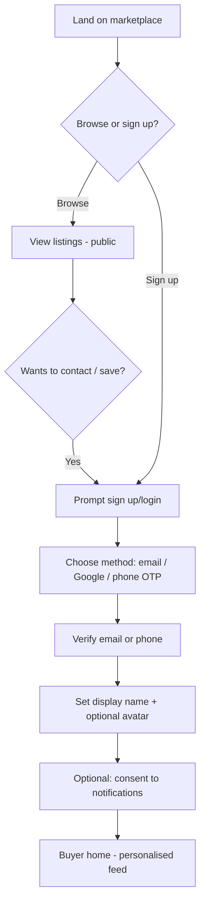

### 2.2 Discover → contact (the primary conversion)
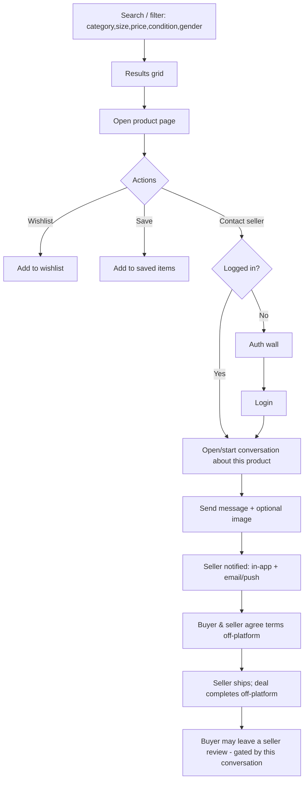

### 2.3 Buyer "dispute" (no on-platform payment)
Because money doesn't flow through ReWorn, disputes are **trust-and-safety**, not
refunds:
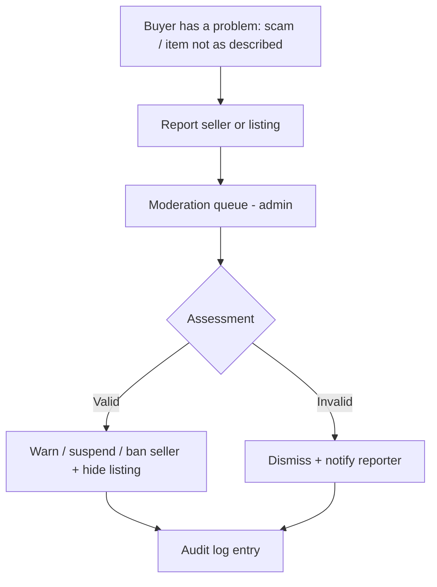
> ⚠️ There is **no platform refund** — the buyer paid the seller directly. This is the
> model's core limitation and the #1 reason to consider v2 on-platform payments.

---

## 3. Seller flow

### 3.1 Registration → subscription onboarding
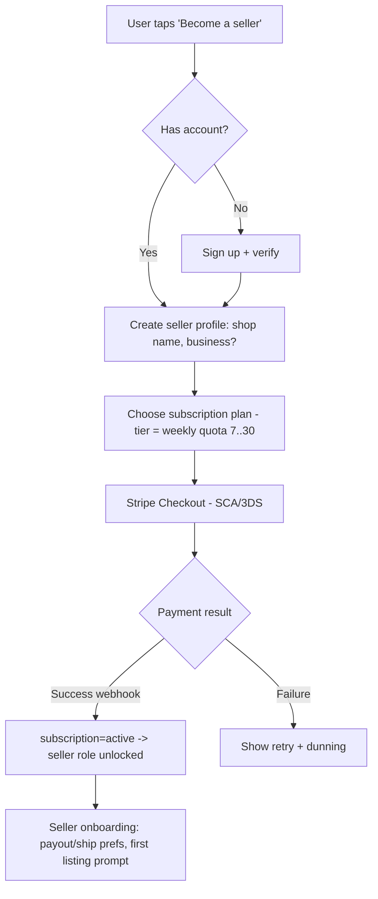
> **Recommendation applied:** offer a **free trial / first-N-free** at step E to beat the
> cold-start (see business review §4.3).

### 3.2 Listing a product (with quota enforcement)
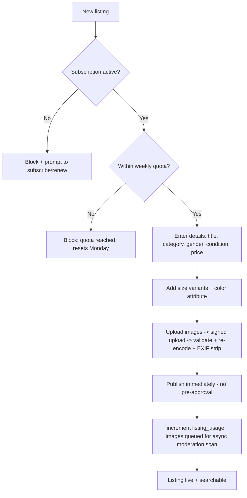

### 3.3 Managing sales & messages
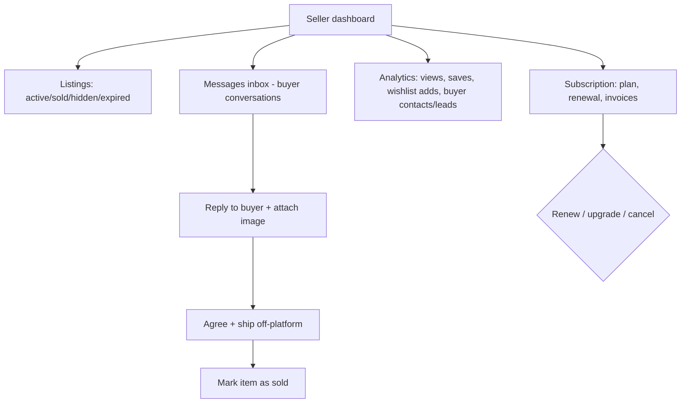

### 3.4 Subscription lifecycle
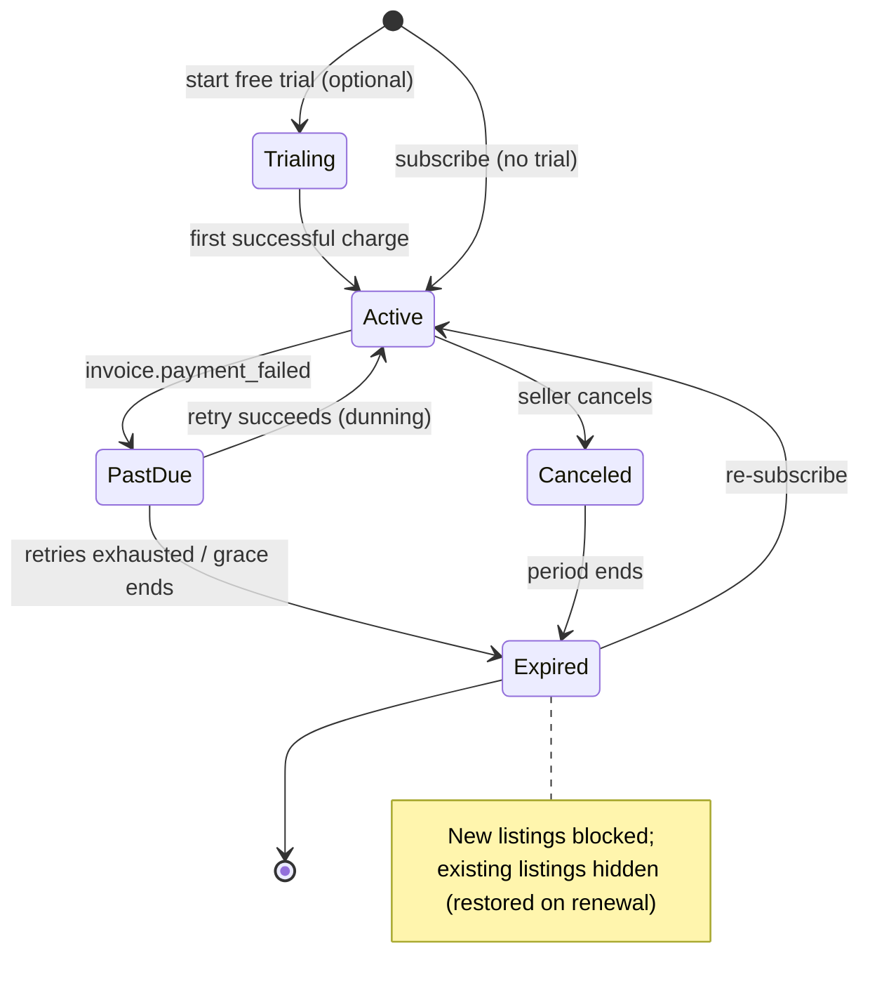

---

## 4. Administrator / Support flow (single combined role)

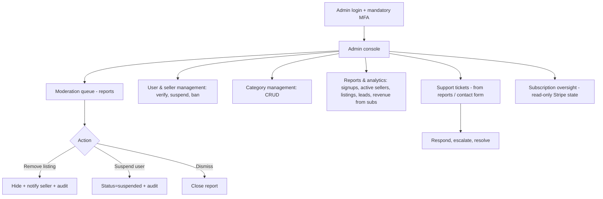

### 4.1 Support ticket / dispute handling
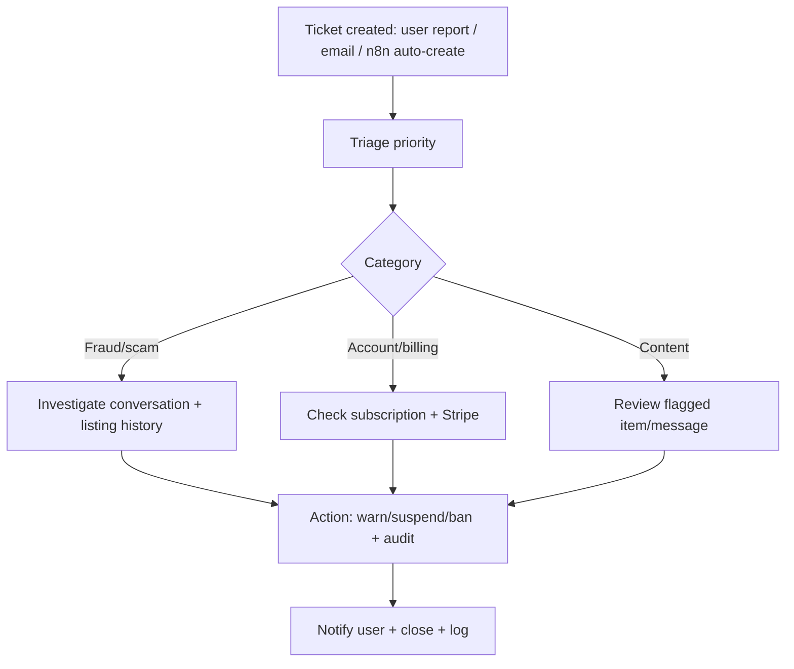

---

## 5. Cross-cutting: authentication flow
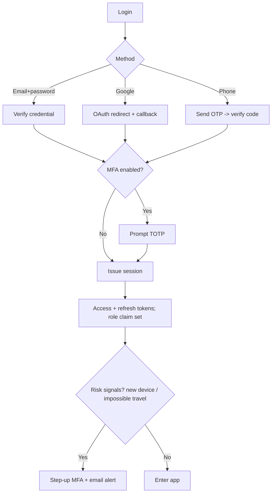

---

## 6. Notification & messaging flow
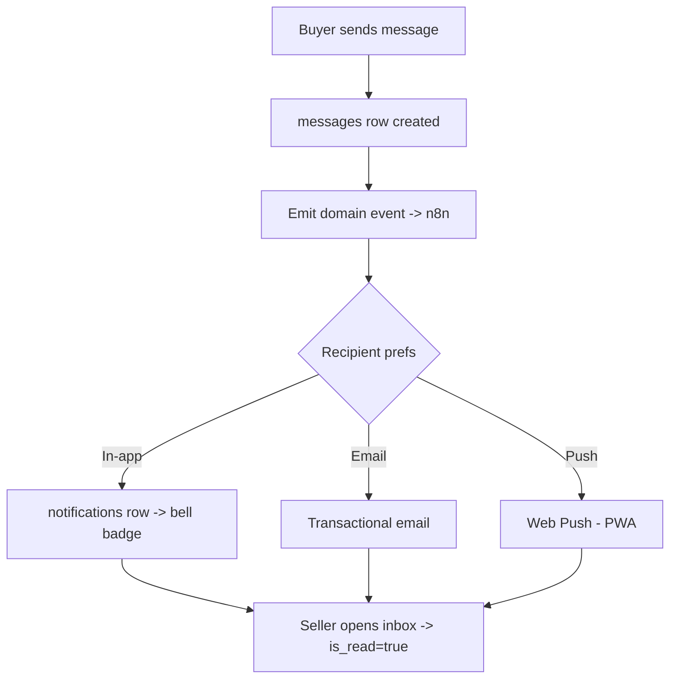

---

## 7. Journey maps (experience view)

### 7.1 Buyer journey map
| Stage | Goal | Touchpoints | Emotions | Risks / drop-off | Design response |
|---|---|---|---|---|---|
| Discover | Find items worth buying | Home, search, filters | Curious | Poor relevance, "everything" noise | Strong filters, niche curation, fast image grid |
| Evaluate | Trust the item & seller | Product page, images, seller rating | Cautious | No buyer protection fear | Seller ratings, verification badge, clear condition |
| Connect | Reach the seller | Contact button, auth wall, chat | Motivated | Auth friction, slow reply | Fast social/OTP login, push nudges to seller |
| Transact | Agree & pay (off-platform) | Chat, external payment | Anxious | **Scam risk** | Safety tips, report button; **v2 on-platform pay** |
| Post | Feel good / recommend | Review, wishlist | Satisfied/annoyed | Bad experience → churn | Gated reviews, easy re-engagement |

### 7.2 Seller journey map
| Stage | Goal | Touchpoints | Emotions | Risks / drop-off | Design response |
|---|---|---|---|---|---|
| Consider | Is it worth paying? | Pricing page | Skeptical | Pay-before-value friction | **Free trial**, show buyer demand |
| Subscribe | Start selling | Stripe checkout | Committed | Payment failure | SCA-ready, dunning, retries |
| List | Get items live fast | Listing form, image upload | Eager | Upload friction, quota confusion | 3-min flow, clear quota meter |
| Sell | Convert contacts | Inbox, analytics | Hopeful | Slow/no buyers (cold start) | Lead analytics, notifications, seeding |
| Retain | Keep subscribing | Dashboard, renewal | Value-seeking | **Disintermediation churn** | Show ongoing lead value; **v2 lock-in via payments** |

---

## 8. Flow-level risks surfaced
- **Auth wall at "contact seller"** is the key conversion gate — keep it frictionless
  (one-tap Google / phone OTP).
- **Quota confusion** (7–30/week, resets weekly) — show a visible quota meter.
- **No-refund reality** must be communicated honestly to buyers (safety guidance) to
  limit reputational damage and DSA/consumer-law exposure.
- **Seller retention** is the whole business — the dashboard must continuously *prove
  lead value*, or churn kills the subscription model.
