# ReWorn — Diagrams
### Phase 8 · Rendered-ready Mermaid

> The full **ERD** lives in [`02-database-erd.md`](02-database-erd.md); **user journeys &
> auth/messaging flows** in [`03-user-flows.md`](03-user-flows.md). This file adds the
> system, backend, API, payment, order-lifecycle, n8n, mind-map, and dependency diagrams.

---

## 1. ERD
See [`02-database-erd.md`](02-database-erd.md) §2 for the complete Mermaid ERD.

---

## 2. High-level system architecture
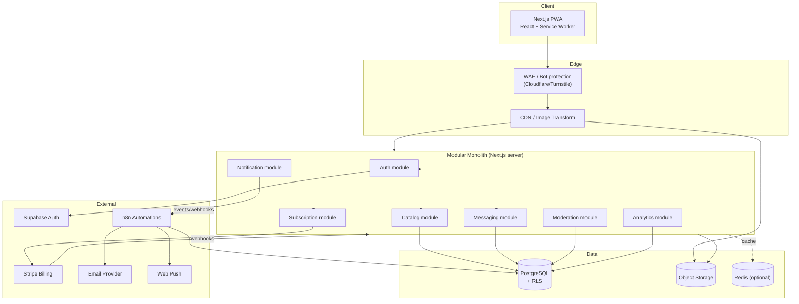

---

## 3. Backend service (module) diagram
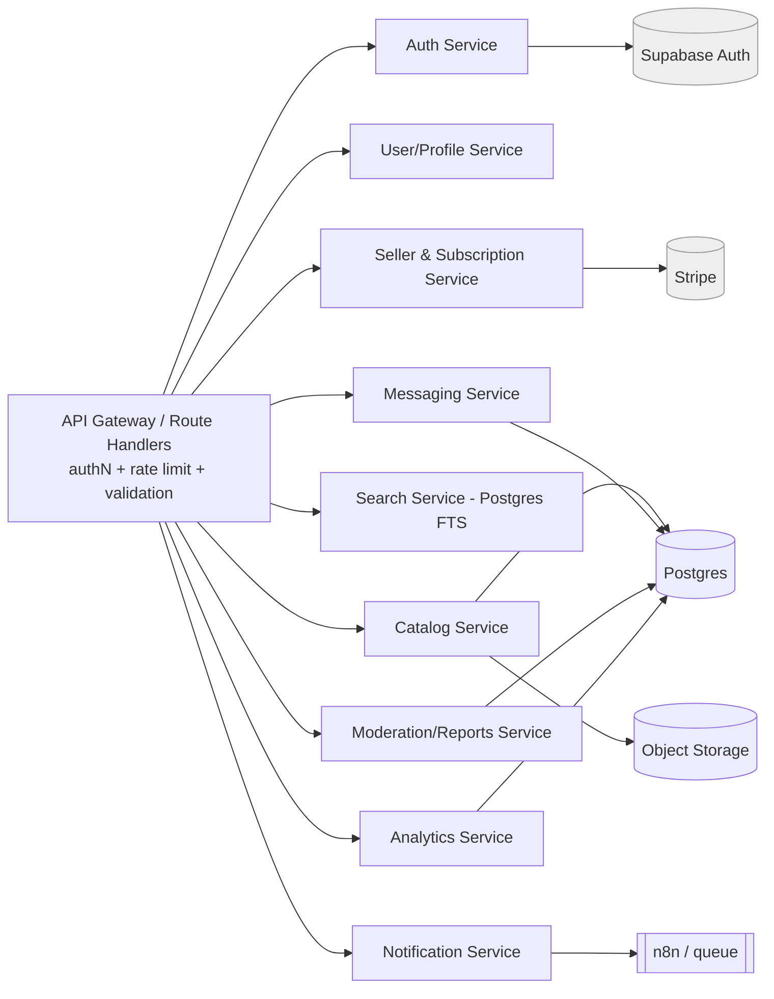

---

## 4. API interaction diagram (representative endpoints)
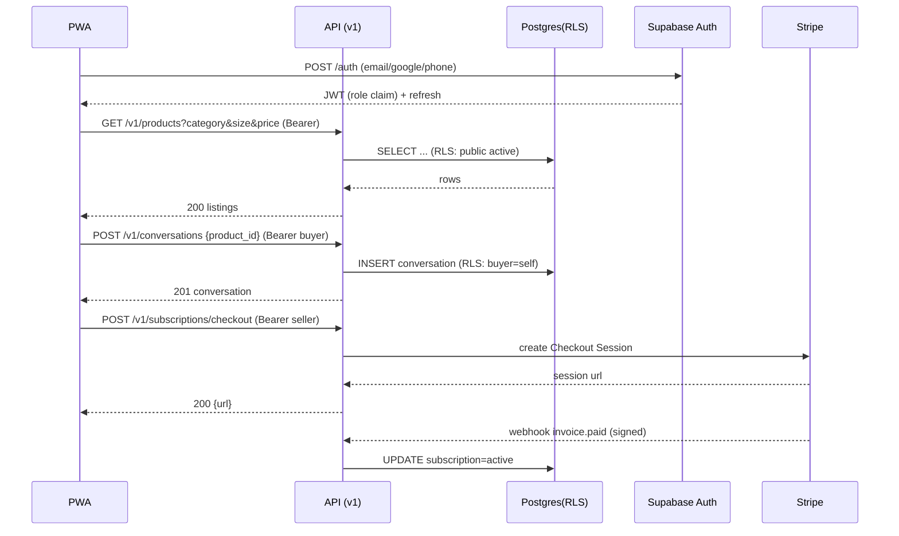

---

## 5. Authentication flow
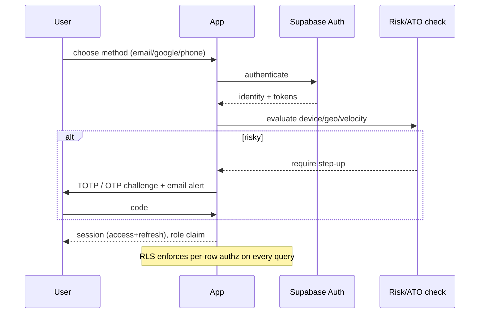

---

## 6. Payment flow (seller subscription)
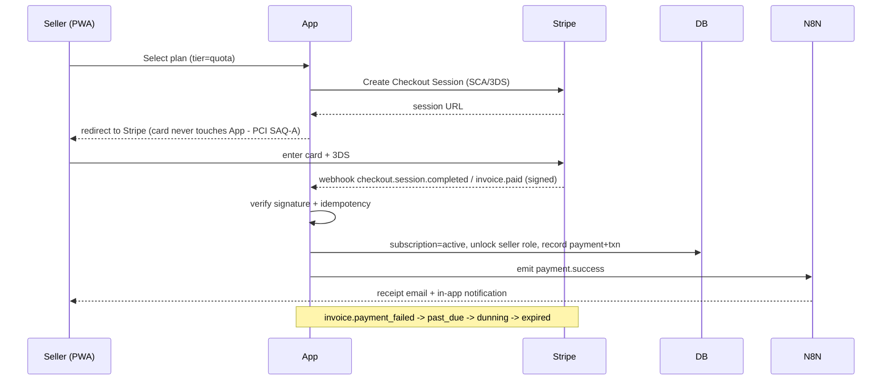

---

## 7. Order lifecycle
> MVP is **classifieds** — the "order" is a conversation that completes off-platform. The
> second diagram shows the **v2 transactional** lifecycle the schema is ready for.

**MVP (conversation lifecycle):**
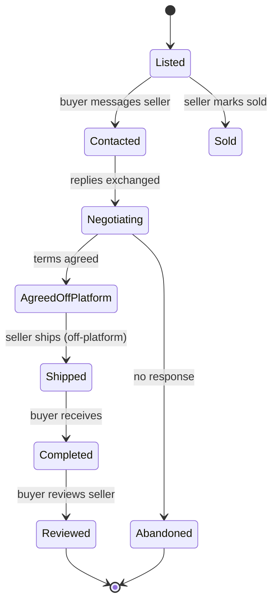

**v2 (transactional lifecycle):**
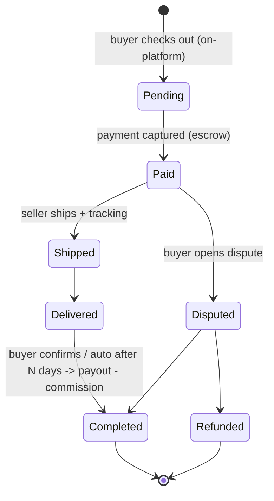

---

## 8. Messaging flow
See [`03-user-flows.md`](03-user-flows.md) §6. Summary:
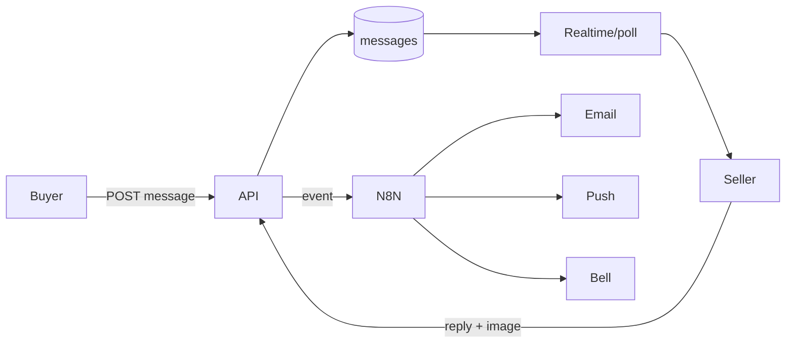

---

## 9. n8n workflow diagrams (representative)

**Seller subscription payment success (WF #7):**
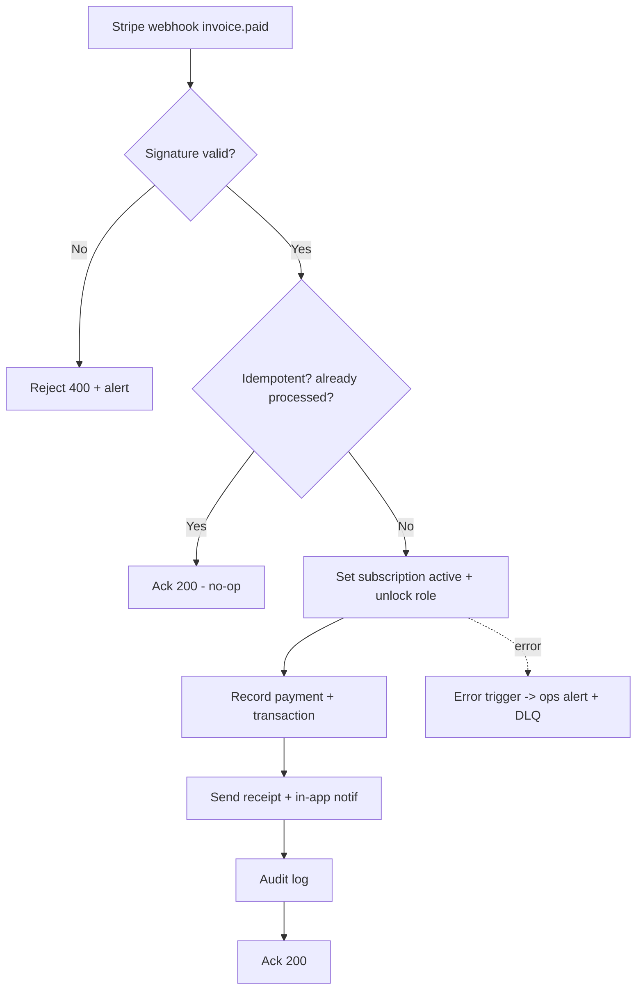

**Post-hoc image moderation (WF #5):**
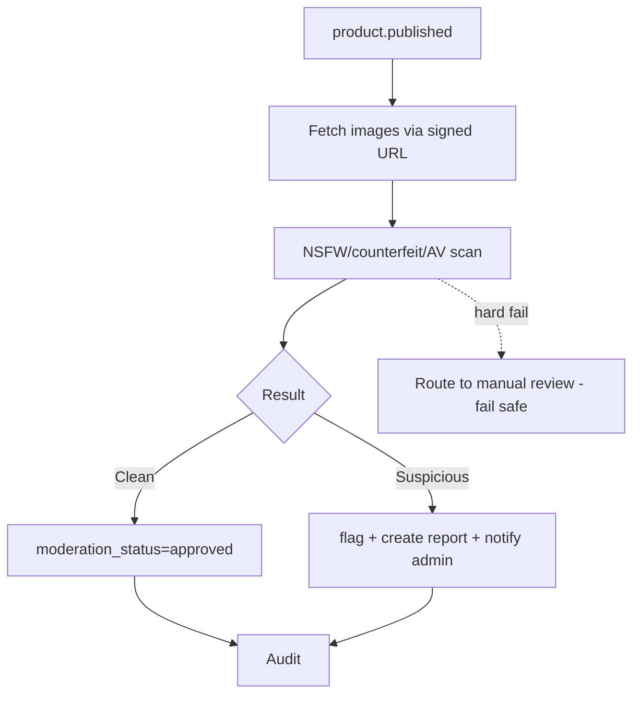

**Fraud detection (WF #19):**
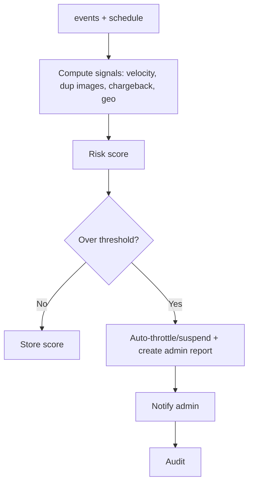

---

## 10. User journey maps
See [`03-user-flows.md`](03-user-flows.md) §7 (buyer & seller experience tables) and
§2–4 (flowcharts).

---

## 11. Product mind map
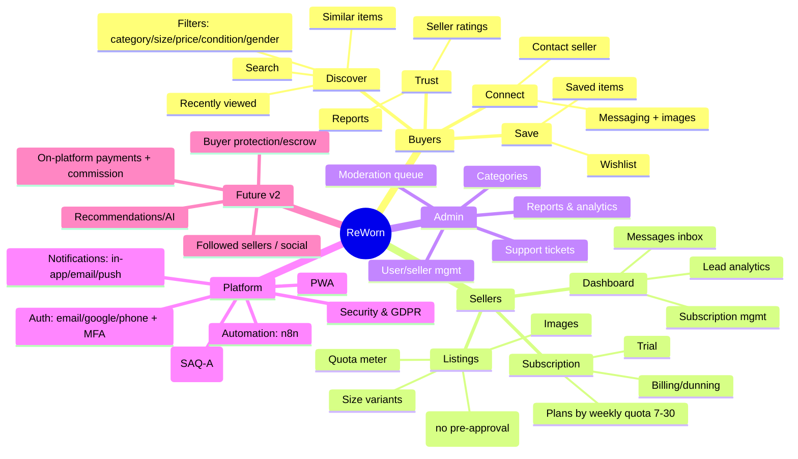

---

## 12. Feature dependency diagram
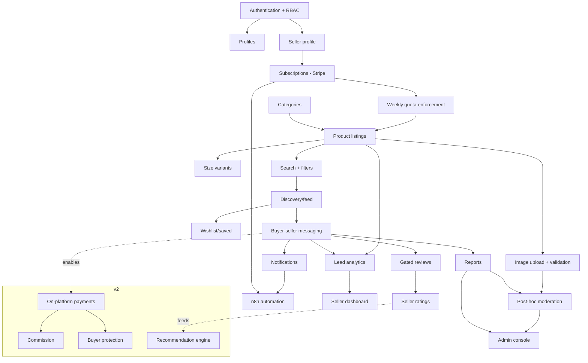

**Critical path for MVP (build order):** Auth+RBAC → Seller profile → Subscriptions →
Quota → Categories/Listings → Images+Moderation → Search/Discovery → Messaging →
Notifications → Reviews/Reports → Admin console → Analytics dashboard.
