# ReWorn — Technology Recommendations & Implementation Roadmap
### Phases 9 & 10

---

## Part A — Technology stack (Phase 9)

**Selection principle:** at a €1,300–€2,000 budget with a September MVP, we **buy**
security-critical, undifferentiated infrastructure (auth, payments, storage, hosting) and
**build** only the differentiated product surface. Every choice below optimises for
speed-to-secure-MVP and low operational burden for a tiny team.

| Layer | Recommendation | Why | Alternatives & trade-off |
|---|---|---|---|
| **Frontend** | **Next.js (App Router) + React + TypeScript**, as a **PWA** | SSR/SSG for marketplace SEO & speed; one codebase → installable PWA (client's choice); ports the existing warm/simple design | Remix (fine, smaller ecosystem); SvelteKit (leaner, smaller talent pool); plain SPA (bad SEO) |
| **Styling/UI** | Tailwind CSS + a small component set | Fast, consistent, matches the token-based concept work | CSS-in-JS (runtime cost); MUI (heavier, less "warm/simple") |
| **Backend** | **Modular monolith** in the Next.js server / lightweight Node service (TypeScript) | One deploy, transactional integrity, minimal ops, fits budget & scale | NestJS microservices (over-engineered); Django/Rails (fine, but splits the TS stack) |
| **Database** | **PostgreSQL** (via **Supabase**) | Relational fit, **RLS** for data-layer authz, JSONB flexibility, full-text search built in | MySQL (weaker FTS/RLS story); MongoDB (poor fit for relational marketplace data) |
| **ORM** | **Prisma** (or Drizzle) | Type-safe, migrations, parameterised queries (SQLi-safe) | Raw SQL (error-prone); Drizzle if you want lighter/faster |
| **Auth** | **Supabase Auth** (email + Google + phone OTP) | Exactly the requested methods; integrates with RLS; free of custom-auth risk | Auth0/Clerk (great DX, cost at scale); custom (do not, at this budget) |
| **File storage + media** | **Supabase Storage / S3-compatible** + image-transform CDN (Cloudflare Images) | Signed direct uploads, on-the-fly WebP/AVIF, cheap | Cloudinary (rich but pricier); self-host (ops burden) |
| **Payments** | **Stripe Billing + Checkout/Elements** | Subscriptions done right, SCA/3DS, **PCI SAQ-A**, Radar fraud, best docs | Paddle (MoR handles EU VAT — worth considering for international); Braintree (weaker subs) |
| **Messaging/Realtime** | **Supabase Realtime** or short-polling | Near-real-time without a socket cluster; matches "no live-chat SLA" | Self-hosted WebSockets (ops); Pusher/Ably (cost) |
| **Notifications** | Email (**Postmark/Resend**) + **Web Push** + in-app; SMS (Twilio) for OTP only | Cost-appropriate multichannel; SMS is expensive → OTP-only | One-provider-does-all (lock-in) |
| **Search** | **Postgres FTS + pg_trgm** (MVP) | Zero extra infra for a small facet set | Meilisearch/Typesense (v2, cheap self-host); Algolia (managed, cost) |
| **Queues / automation** | **n8n** (requested) + DB-backed jobs | Visual business automation, retries, low code | Temporal/BullMQ (more power, more ops) |
| **Caching** | CDN + HTTP/ISR now; **Redis only if needed** | Avoid premature infra | Always-on Redis (unneeded cost early) |
| **Monitoring/Logging** | **Sentry** + uptime monitor + structured logs | Cheap, effective error/uptime visibility | Datadog (overkill/cost at this size) |
| **CI/CD** | **GitHub Actions** | Free tier, ubiquitous, simple | GitLab CI/CircleCI (fine) |
| **Deployment/Hosting** | **Vercel** (frontend/app) + **Supabase** (DB/auth/storage) + **Render/Fly/Railway** or Supabase-hosted for n8n | Managed, autoscaling, low ops; **note the client mentioned Render** — Render can host the whole app + n8n if preferred over Vercel | Self-managed VPS (cheapest £ but highest ops risk); AWS from scratch (too much for budget) |
| **Secrets** | Host secret store / Doppler | No secrets in repo, rotation | .env in repo (never) |
| **Analytics** | Plausible/PostHog (self-host option) | GDPR-friendly, no ad-tech | GA4 (privacy/consent burden) |

> **Render note (client's stated deploy target):** Render works well here — deploy the
> Next.js app as a **Web Service**, host **n8n** as a separate Web Service (persistent
> disk), use **Supabase** (or Render's managed Postgres) for the DB, and object storage
> via Supabase/Cloudflare. The static `preview.html` concept is a Render **Static Site**;
> the real app is a **Web Service** (needs a server runtime). This matches the earlier
> deploy guidance.

**Consolidated stack:** Next.js PWA · TypeScript · Postgres/Supabase (Auth+Storage+RLS) ·
Prisma · Stripe Billing · n8n · Postmark + Web Push · Sentry · GitHub Actions · Vercel or
Render.

---

## Part B — Implementation roadmap (Phase 10)

> **Governing rule:** ship a **secure, stable, narrowly-scoped MVP** before anything
> advanced. Resolve the C1/C2 contradictions and pick a launch niche **before Phase 1
> code** (they change scope).

### Phase 0 — Discovery sign-off & foundations *(before build)*
- **Goals:** lock scope; resolve conflicts; set up rails.
- **Work:** confirm assumptions register (ASM-1…9); decide niche; decide free-trial;
  confirm subscription tiers & prices; legal basics (privacy policy, prohibited-items,
  DPA list); repo, CI/CD, environments, Supabase + Stripe (test) + n8n provisioned;
  design tokens from the warm/simple concept.
- **Dependencies:** client decisions.
- **Complexity:** Low · **Tech risk:** Low · **Business risk:** 🔴 High (scope clarity is
  make-or-break).
- **Testing:** n/a (setup) · **Deploy:** staging skeleton live.

### Phase 1 — Secure core (auth, identity, RBAC, PWA shell) — **MVP part 1**
- **Goals:** users can sign up/in securely; app shell installable.
- **Features:** email/Google/phone auth; email/phone verification; profiles; RBAC +
  **RLS policies**; session hardening; security headers/CSP; rate limiting; PWA shell;
  n8n WFs #1–4 (registration, verify, reset, welcome).
- **Dependencies:** Phase 0.
- **Complexity:** Med · **Tech risk:** Med (RLS correctness) · **Business risk:** Low.
- **Testing:** authz/RLS test suite, auth E2E, security smoke (headers, rate limits).
- **Deploy:** staging → prod behind waitlist.

### Phase 2 — Seller subscriptions + listings + catalog — **MVP part 2 (the business)**
- **Goals:** sellers pay and list; buyers browse.
- **Features:** Stripe Billing (plans/tiers, checkout, webhooks, dunning); **weekly quota
  enforcement**; seller onboarding; listing CRUD (no pre-approval) with size variants +
  images (signed upload, validation, EXIF strip); categories; catalog browse + Postgres
  search/filters (category/size/price/condition/gender); n8n WFs #5,7,8,9,10,12,16(subs).
- **Dependencies:** Phase 1.
- **Complexity:** High · **Tech risk:** Med-High (payments/webhooks idempotency, uploads)
  · **Business risk:** 🔴 High (this *is* the revenue model — must work flawlessly).
- **Testing:** Stripe webhook/idempotency tests, quota edge cases, upload-validation
  security tests, catalog/search tests.
- **Deploy:** closed beta with real (test-mode) sellers.

### Phase 3 — Connection layer (messaging, wishlist/saved, notifications) — **MVP part 3**
- **Goals:** the core conversion — buyer contacts seller — works end to end.
- **Features:** conversations + messages + image attachments; wishlist & saved items;
  in-app bell + email/push; abuse controls (rate limits, block/report); n8n WFs
  #13,14,15,18,20.
- **Dependencies:** Phase 2.
- **Complexity:** Med-High · **Tech risk:** Med (realtime/abuse) · **Business risk:** 🔴
  High (no conversion = no product).
- **Testing:** messaging E2E, abuse/rate-limit tests, notification delivery.
- **Deploy:** **MVP LAUNCH candidate** (niche, local).

### Phase 4 — Trust, moderation & admin — **launch-hardening**
- **Goals:** operate safely at launch.
- **Features:** reports + moderation queue; admin/support console (users, sellers,
  categories, reports, subscription oversight); **gated reviews & ratings**; audit logs;
  fraud signals (n8n #19); support ticketing (#20).
- **Dependencies:** Phases 2–3.
- **Complexity:** Med · **Tech risk:** Med · **Business risk:** 🔴 High (legal/DSA + trust).
- **Testing:** moderation flows, RBAC on admin, audit completeness, review-integrity gate.
- **Deploy:** **Public MVP launch** (local).

### Phase 5 — Analytics & seller retention — **post-launch**
- **Goals:** prove lead value → reduce churn.
- **Features:** listing/lead analytics dashboard (views, saves, contacts), revenue-from-
  subs reporting, review requests (#17), quota/health nudges, price-drop alerts.
- **Complexity:** Med · **Risk:** Med (retention is existential for a sub model).
- **Testing:** analytics accuracy, GDPR-safe tracking.

### Phase 6 — Recommendations, richer search, international — **growth (v2)**
- **Goals:** relevance + expansion.
- **Features:** content-based → collaborative recs; Meilisearch if needed; i18n/multi-
  currency; SMS/push expansion; optional videos.
- **Complexity:** Med-High · **Risk:** Med.

### Phase 7 — 🔑 Strategic pivot: on-platform payments + commission + buyer protection — **v2**
- **Goals:** fix disintermediation & trust; create lock-in & transaction revenue.
- **Features:** Stripe Connect (marketplace payouts), escrow-style hold, commission,
  orders/order_items/refunds (schema already present), dispute resolution; WFs #6, goods
  #16 activated.
- **Complexity:** High · **Tech risk:** High (marketplace payments, PCI, payouts, KYC) ·
  **Business risk:** transformative (this is what makes it defensible).
- **Note:** **out of the €2k budget** — a separate, larger engagement. Architected-for now.

---

### Roadmap at a glance

```mermaid
flowchart LR
    P0[P0 Sign-off & foundations] --> P1[P1 Secure core + auth]
    P1 --> P2[P2 Subscriptions + listings]
    P2 --> P3[P3 Messaging + notifications]
    P3 --> P4[P4 Trust/moderation/admin]
    P4 --> LAUNCH{{Public MVP - local}}
    LAUNCH --> P5[P5 Analytics + retention]
    P5 --> P6[P6 Recs + intl]
    P6 --> P7[P7 On-platform payments + commission - v2]
```

**MVP = Phases 0–4.** Everything from Phase 5 on is post-launch/growth and should be
scoped and quoted separately from the €1,300–€2,000.

---

## Part C — Testing & deployment strategy (cross-cutting)

- **Testing pyramid:** unit (services, quota, pricing) → integration (DB/RLS, Stripe
  webhooks, uploads) → E2E (auth, list, contact, subscribe) → **security tests**
  (authz/RLS, rate limits, upload validation, headers) → manual moderation/abuse
  scenarios. Target meaningful coverage on money + auth + authz paths specifically.
- **Environments:** local → staging (Stripe test mode) → production; migrations gated in
  CI; preview deploys per PR.
- **Release:** trunk-based + feature flags; canary/waitlist before public; DB migrations
  backward-compatible (expand/contract).
- **Rollback:** immutable deploys, one-click rollback; Stripe in test mode until Phase 2
  sign-off; backups + PITR on Postgres.
- **Go-live checklist:** security headers, RLS coverage audit, rate limits, Stripe live
  keys + webhook secrets rotated, GDPR docs published, moderation queue staffed, monitoring
  + alerts wired, incident runbook.
